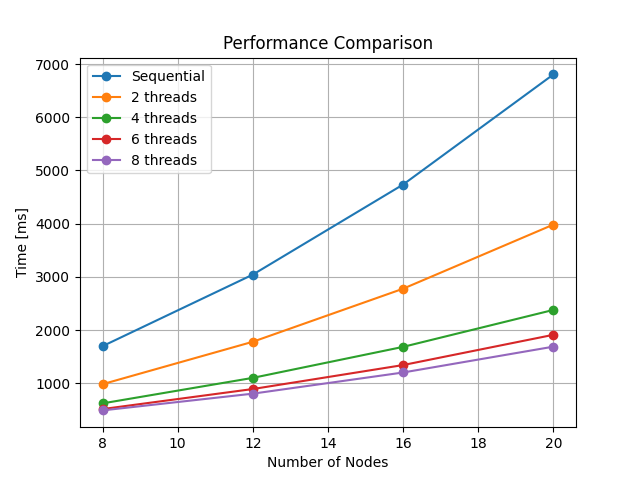

# Ant colony optimization for resolving traveling salesman problem

In this project we are solving the symmetrical traveling salesman problem.
 Traveling salesman problem is graph problem where we are finding shortest path that goes through all the nodes once. Symmetrical in the name only tells us that the part from one node to another is same on both directions.

Ant colony optimization is nature inspired approach that uses collective behavior of ants to discover path in the graph. 
The algorithm is inspired by ants and pheromone they leave on the trail in search for the food. The more pheromone on the trail the ant will want to follow that path more. 
But naturally ant pheromone evaporate, and exactly that property makes ants follow the shorter path. On the shorter path ants will have more pheromone, because it took less time to reach the goal and pheromones evaporated less. 
However ants also have their desires and sometimes they will explore on their own and maybe find even shorter path. 
Exactly this ballance between exploration and exploitation is what makes nature inspired algorithms interesting.

## Ant colony optimization algorithm

### 1. Setup

At the start we need to initialize pheromone trails between all nodes in the graph.

### 2. Place the ants on the graph

At the second stage we place number of ants on the random starting nodes in the graph.

### 3. Construct ant trails

Each ant that was placed in the graph builds his own trail independently. And we allow ant to visit only nodes he have not visited yet. 
Next node we choose based on the weighted selection, and weight of choosing next node is equal to: $d_{ij}^\alpha * p_{ij}^\beta$  
$d_{ij}$ represents the distance of trail from node $i$ to node $j$ 
$\alpha$ represents the factor of distance in choosing next city 
$p_{ij}$ represents the pheromone value on trail from node $i$ to node $j$ 
$\beta$ represents the factor of pheromones in choosing next city 

By changing $\alpha$ and $\beta$ we are directly changing exploration vs exploitation ratio.

### 4. Update pheromone trail

If ants trail is of length $L$ we can create $pd = Q/L^k$ 
Where $pd$ represent how much pheromone will be deposited on all the trails that ant traveled no his trail. 
$Q$ is usually the number of ants in the algorithm or the average length of the trail. 
And $k$ is algorithm constant that is used to lower the $pd$ while extending the gap between lowest and highest possible pheromone deposit. This makes ants more focus on the pheromone.

After all of this we have one more parameter $P$ in the algorithm, and that parameter represents the pheromone evaporation rate. 
We do not want pheromone to accumulate on the trails that we have visited in the long past.

### 5. Stopping condition

We are placing ants, constructing trails and updating pheromone trail until we reach a stopping condition at witch point we can choose to get result in the following ways:
 - We simply follow the trail with the most pheromones
 - Or we can store the shortest path while executing algorithm and return this at the end

Stopping condition can be number of iterations of the algorithm or for example no changes to the minimum path for some number of iterations.

## Pros and cons of ant colony optimization

Pros:
 - Great for balancing exploration vs exploitation
 - Can be parallelized
 - Have great results with fine tuned parameters
Cons:
 - Have a lot of parameters, and required fine tuning
 - Not good if you have computing limitations
 - Not the best on small graphs

Ant colony optimization really shines with greater graphs, and with little graphs it introduces a lof of overhead, when simpler solutions could do just the same job. 
One more problem is that there are not so much trails in smaller graphs so it is really a challenge to make parameters just right for pheromones to not accumulate on the shortest paths. And when they do accumulate there, we have nearest neighbor algorithm. 
The main point of ant colony optimization is exploration part of the algorithm, but on smaller graphs we do not have much potential for exploration because there is not much to explore. 

## About the implementation

The whole point of this implementation is to explore parallel ant colony optimization and how much parallelization can help. So in this implementation we will simulate that we have a big graph. 
We are using 200 ants, that is too much for the 20 nodes graph we have, but with this we will have a good estimate to how would the parallel algorithm behave with the larger graph. 
With that in mind, our algorithm may not be the best for solving this 20 node graph TSP but, we will explore the parallelism potential of ant colony optimization, and we will see how good of a speed up we will get if we tried to solve TSP for the graph with 200 nodes.

## Parallelization of the algorithm

The parallelization of ant colony optimization is done by running construction of trails in parallel. We can separate ants into cores, and since their work is independent of one another we do not have to share anything between them. The only thing all threads need in the parallel implementation is pheromone matrix that represents the pheromones on the trails, but all treads read data from it, so parallelization is not problem in this case.

The bottleneck of ant colony optimization parallel implementation is synchronization of all thread that occur when we need to update the pheromone matrix. The synchronization occurs because we need to update the pheromone matrix, and since we need to stop all reads while we change the matrix, we need to stop all threads. This is the part of the algorithm that is essential for the convergence of algorithm so we can not exclude this part from the algorithm.

## Results

From the shown results we can see that the performance gain we are getting from using even only two cores is significant. Also one important thing to note is that the ant colony simulation is not the fastest algorithm. Is have an emphasis on the exploration and that makes it great for big graphs. And we have shown that parallelizing this algorithm can significantly speed it up.